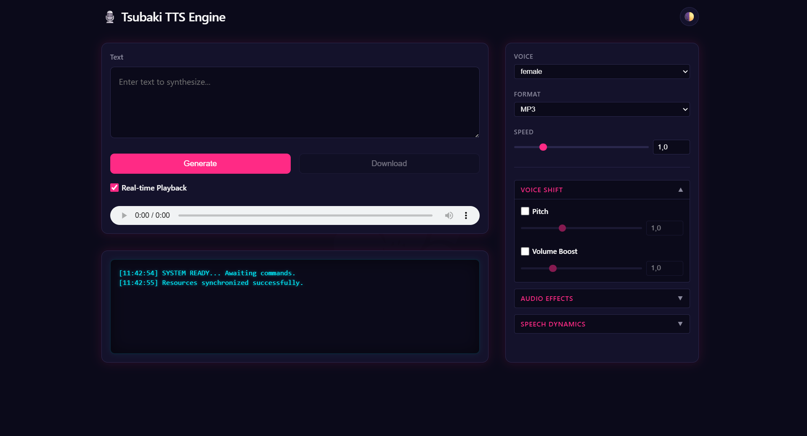

# 🌸 Tsubaki TTS Engine (ONNX Runner)

Tsubaki TTS Engine is a blazingly fast, portable, and production-grade Text-to-Speech server written in **C# (.NET 8)**. It leverages the power of **Piper (VITS)** neural networks and **OpenVoice** to generate high-fidelity audio with support for instant voice cloning and real-time DSP effects.

---

## 🖥️ Web Dashboard


_Built-in web interface for testing voices and DSP effects_

---

## 📥 Download

**[💻 Tsubaki TTS Engine v1.0.0 (GitHub Releases)](https://github.com/MrHryhorii/SmartStack/releases/tag/tsubakitts-v1.0.0)**
_Direct Plug-and-Play binary downloads for Windows and Linux. Includes pre-configured base models and cloneable voices!_

---

## 🚀 Why Tsubaki over Python alternatives?

Most modern open-source TTS engines are written in Python. This often leads to "dependency hell": CUDA version conflicts, gigabytes of PyTorch libraries, and virtual environment nightmares.

Tsubaki is built with an **engineering-first approach** to distribution:

- **No Python Required:** Runs purely on compiled C# and `Microsoft.ML.OnnxRuntime`.
- **Portable (Self-Contained):** Can be compiled into a single executable. Just download and run.
- **Dynamic Hardware Acceleration:** Automatically detects and utilizes your GPU (DirectML for Windows, CUDA for Linux) and gracefully falls back to CPU without crashing.
- **Memory Protection (OOM Guard):** Built-in queueing and semaphore system that calculates available VRAM/RAM to prevent server crashes under heavy load.

---

## ✨ Key Features

| Feature                           | Description                                                                                                                                                        |
| --------------------------------- | ------------------------------------------------------------------------------------------------------------------------------------------------------------------ |
| 🔌 **OpenAI API Compatible**      | Exposes a `/v1/audio/speech` endpoint that perfectly mimics the official OpenAI API. Drop-in replacement for SillyTavern, LangChain, AutoGen, and other AI agents. |
| 🧬 **Zero-Shot Voice Cloning**    | Integrated with the OpenVoice V2 architecture. Clone any voice instantly by dropping a clean 10-second `.wav` file into the `Voices` folder.                       |
| 🌍 **Foreign Word Pronunciation** | Offline language detection via Lingua. Detects foreign words and applies phoneme approximation for natural accented pronunciation.                                 |
| 🎛️ **Studio-Grade DSP Effects**   | Real-time audio effects (Telephone, Overdrive, Reverb, etc.), pitch and volume shifting.                                                                           |
| 🌊 **Real-Time Streaming**        | Supports Chunked Transfer Encoding — listen to audio before generation is complete.                                                                                |
| 🖥️ **Built-in Web Dashboard**     | Sleek, user-friendly web interface available out-of-the-box for testing voices and effects.                                                                        |

---

## 🛠️ Building from Source

Ensure you have the [.NET 8 SDK](https://dotnet.microsoft.com/download) installed.

**Option A — Clone only the `ONNX_Runner` folder (recommended):**

```bash
git clone --filter=blob:none --sparse https://github.com/MrHryhorii/SmartStack.git
cd SmartStack
git sparse-checkout set ONNX_Runner
cd ONNX_Runner
```

**Option B — Clone the full SmartStack monorepo:**

```bash
git clone https://github.com/MrHryhorii/SmartStack.git
cd SmartStack/ONNX_Runner
```

### 🏗️ Compiling the Server

Tsubaki uses a smart build system. You can build a **"Full"** version (includes GPU libraries, very large) or a **"Lightweight CPU-only"** version.

> ⭐ For 90% of users and home servers, the **CPU-only version is highly recommended**. It is significantly smaller, completely hardware-agnostic, and the performance difference on modern CPUs is negligible.

**1. Windows (Full: DirectML + CPU)**
Automatically uses your GPU via DirectX 12 (works with NVIDIA, AMD, and Intel GPUs).

```bash
dotnet publish -c Release -r win-x64 --self-contained true -o ./Publish/Tsubaki-Windows-Full
```

**2. Windows (Lightweight: CPU Only)**

```bash
dotnet publish -c Release -r win-x64 -p:CpuOnly=true --self-contained true -o ./Publish/Tsubaki-Windows-CPU
```

**3. Linux (Lightweight: CPU Only) — ⭐ RECOMMENDED**

```bash
dotnet publish -c Release -r linux-x64 -p:CpuOnly=true --self-contained true -o ./Publish/Tsubaki-Linux-CPU
```

**4. Linux (Full: CUDA + CPU) — ⚠️ ADVANCED USERS ONLY**
Builds the massive NVIDIA CUDA version. See the [Linux Deployment](#-docker--linux-deployment) section below for strict hardware and software requirements.

```bash
dotnet publish -c Release -r linux-x64 --self-contained true -o ./Publish/Tsubaki-Linux-Full
```

**5. Docker (Lightweight CPU)**
The provided `Dockerfile` is pre-configured to build the lightweight CPU version to keep your container small and stable.

```bash
docker-compose up --build -d
```

> ⚠️ **IMPORTANT: Voice Model Required**
> The compiled application does not include a Piper voice model out-of-the-box to keep the binary size small. Before starting the server, you must download a voice model (`.onnx` + `.json`) and configure its path. See the [Installation & Model Management](#-installation--model-management) section below for details.

---

## 🗣️ Finding Voice Models

All official Piper voices are hosted on HuggingFace:

**👉 [rhasspy/piper-voices on HuggingFace](https://huggingface.co/rhasspy/piper-voices/tree/main)**

The repository contains **35 languages**, each in its own folder (`en`, `de`, `fr`, `uk`, `zh`, etc.). For each voice you need to download exactly **2 files**:

| File          | Extension    | Description                                  |
| ------------- | ------------ | -------------------------------------------- |
| Model weights | `.onnx`      | The neural network — this is the large file  |
| Model config  | `.onnx.json` | Metadata: sample rate, phonemes, speaker IDs |

### How to download a voice

1. Browse to your language folder, e.g. [`/en`](https://huggingface.co/rhasspy/piper-voices/tree/main/en)
2. Navigate into a voice subfolder (e.g. `en_US/lessac/medium/`)
3. Download both files:
   - `en_US-lessac-medium.onnx`
   - `en_US-lessac-medium.onnx.json`
4. Place both files into your `Model` folder next to the executable

> ⚠️ Both files **must be present** — the engine will fail to load without the accompanying `.json` config.

### Available quality tiers

Most voices come in multiple quality levels. Higher quality = larger file and more VRAM:

| Quality  | Approx. Size | Notes                            |
| -------- | ------------ | -------------------------------- |
| `x_low`  | ~5 MB        | Fast, lower fidelity             |
| `low`    | ~15 MB       | Good for low-end hardware        |
| `medium` | ~60 MB       | Recommended for most use cases   |
| `high`   | ~130 MB      | Best quality, requires more VRAM |

### OpenVoice V2 — Voice Cloning Models (ONNX)

The voice cloning engine requires separate OpenVoice models. Tsubaki downloads them automatically on first run, but you can also download them manually:

**👉 [Hinotsuba/OpenVoice-ONNX-v2 on HuggingFace](https://huggingface.co/Hinotsuba/OpenVoice-ONNX-v2)**

This repository contains 3 files needed for cloning:

| File                | Description                                                                 |
| ------------------- | --------------------------------------------------------------------------- |
| `tone_extract.onnx` | Extracts a 256-dimensional voice fingerprint from a reference audio sample  |
| `tone_color.onnx`   | Transfers the extracted voice characteristics onto the generated base audio |
| `tone_config.json`  | Hyperparameters and structural configuration for both models                |

> These models are released under the **MIT License** and are free for commercial use.

---

## 📂 Installation & Model Management

### 1. Adding a Piper Model (ONNX)

The server features a highly flexible model discovery system. You have **3 ways** to specify the path to your `.onnx` and `.json` model files:

#### Option A: "Out of the Box" (Relative Path)

Place your model files into the `Model` folder exactly next to your compiled executable. The server will automatically find them on startup.

#### Option B: Change Directory (via `appsettings.json`)

If you store models on a different drive, open `appsettings.json` and change the `ModelDirectory`:

```json
"ModelSettings": {
  "ModelDirectory": "D:\\AI_Models\\Piper"
}
```

#### Option C: Exact File Paths (Advanced)

If your files have custom names or are scattered across the system, you can specify exact paths.

> ⚠️ **WINDOWS USERS:** When writing absolute paths in JSON, you must use double backslashes (`\\`)!

```json
"ModelSettings": {
  "ExactModelFilePath": "C:\\Models\\voice.onnx",
  "ExactConfigFilePath": "D:\\Configs\\voice_config.json"
}
```

---

### 2. Voice Cloning (OpenVoice)

The server will automatically download the necessary base cloner models from HuggingFace on the first run.

**To add a new cloneable voice:**

1. Place a clean voice sample (`.wav`, 5–15 seconds) into the `Voices` folder.
2. The filename (e.g., `John.wav`) becomes the voice ID.
3. Use `"voice": "John"` in your API requests.

---

## ⚙️ Server Configuration (`appsettings.json`)

The `appsettings.json` file is completely pre-configured and ready to use out-of-the-box, but you can deeply customize the engine's behavior to fit your specific needs. Most users only ever need to set the model path and the languages list — everything else can safely be left at its defaults.

---

### 🌍 Phonemizer & Language Settings — Most Important Setting

The `PhonemizerSettings` block controls how the server handles foreign words encountered in text. **In most cases, you should manually configure the `"SupportedLanguages"` list** — this is the single most impactful setting to configure after your model path.

```json
"PhonemizerSettings": {
  "SupportedLanguages": ["en", "uk", "fr"]
}
```

- **How it works:** Add languages that your base Piper model doesn't speak natively, but might encounter in your texts — for example, an English model reading a French name or a Ukrainian phrase. The engine uses offline language detection via [Lingua](https://github.com/searchpioneer/lingua-dotnet) to identify the foreign words and approximate their pronunciation using the base model's available phonemes, producing a natural "accented" result rather than skipping or mangling the word.

- **Format:** Use short espeak language codes — `"en"`, `"uk"`, `"de"`, `"fr"`, `"zh"`, etc.

- **Performance Warning:** ⚠️ Every language added to this list increases memory consumption and slows down the overall voice synthesis. It is highly recommended to limit this list to **2–3 languages** that are most likely to appear in your texts.

- **Context & Punctuation:** If foreign words are phonetically similar to the model's native language and appear in a "wall of text" without proper punctuation, the detector might misidentify them and pronounce them incorrectly. Proper punctuation (commas, quotes, separate sentences) drastically improves accuracy. Languages with completely different alphabets (e.g., Cyrillic vs. Latin) are detected far more reliably than similar-looking Latin languages.

- **Priority Tweaks:** Other parameters in this block (like `"MaxBonusMultiplier"`) shift the detection priority back towards the model's native language for short, ambiguous, or borrowed words. The defaults are well-tuned and rarely need adjustment.

---

### 🌐 Network & Access

- **`Kestrel > Endpoints > Http > Url`** — Defines the port the server listens on. Default is `http://+:5045`.

- **`CorsSettings`** — Controls Cross-Origin Resource Sharing. Setting `"AllowAnyOrigin": true` completely disables access limits and is perfectly fine for local or home use. If set to `false`, the server will only accept requests from the domains listed in the `"AllowedOrigins"` array, which you can freely edit to secure your endpoints.

- **`ApiSettings > MaxTextLength`** — Imposes a hard character limit on text-to-speech requests. Setting this to `0` removes the limit entirely, which is perfectly fine for personal or home use.

---

### ✂️ Text Processing

- **`ChunkerSettings`** — Piper models notoriously struggle with massive, unbroken blocks of text. This setting automatically slices "walls of text" and run-on sentences into smaller, logical chunks for stable and high-quality generation. Keep this enabled.

---

### 🛡️ Resource Management (Hardware & Limits)

- **`HardwareSettings`** — Note that this is **not** a strict hardware cap. It simply tells the server's internal queueing system how much free resources you generally have versus how much a single request consumes. Actual memory usage depends entirely on your chosen Piper model. **For home use, you can completely ignore this section.**

- **`RateLimitSettings`** — Provides basic anti-spam and anti-DDoS protection by restricting the number of requests allowed from a single IP address within a specific time window. Useful for public-facing deployments.

---

### 🎛️ Audio & DSP

- **`EffectsSettings`** — Standard OpenAI API clients (like SillyTavern or AutoGen) do not support sending custom DSP parameters in their requests. This section allows you to define a `"DefaultEffect"` that the server will automatically apply to all incoming API requests unless explicitly overridden by a custom client (like the built-in web dashboard). See the [Default Effects & Environments](#️-default-effects--environments) section for all available values.

- **`DspSettings`** — Adds an audio cleanup pass (Low-Pass Filter) to the generated speech, ensuring high-frequency noise reduction. This is heavily recommended if you are using a lower-quality Piper model or a tricky voice clone.

- **`ClonerSettings`** — Controls the OpenVoice cloning behavior. It is best not to touch these. Increasing the intensity often yields a caricature-like exaggeration of the voice characteristics, while decreasing it simply reverts the audio back to the default base model's voice.

---

### 🚫 Advanced Modules

- **`OnnxSettings`** — Designed for advanced users testing highly specific experimental models. Leave at defaults unless you know exactly what you are doing.

- **`StreamSettings`** — Keep `"EnableStreaming": true`. Streaming audio chunks directly to the client is always faster and less resource-intensive than forcing the server to build and hold a complete audio file in memory before sending. There is no reason to disable this.

---

## 🎛️ Default Effects & Environments

Since standard OpenAI clients (like SillyTavern) cannot send custom DSP effect parameters, Tsubaki allows you to set a **Default Effect** in `appsettings.json`. This effect will be automatically applied to all incoming API requests unless overridden.

```json
"EffectsSettings": {
  "EnableGlobalEffects": true,
  "DefaultEffect": "LoFiTape",
  "DefaultIntensity": 1.0,
  "DefaultEnvironment": "LivingRoom",
  "DefaultEnvironmentIntensity": 0.25
}
```

### Available Voice Effects (`DefaultEffect`)

| Value           | Description                                                    |
| --------------- | -------------------------------------------------------------- |
| `None`          | Bypass — clean audio                                           |
| `Telephone`     | Lo-Fi equalization with hard transistor clipping               |
| `Overdrive`     | Warm tube saturation and cubic waveshaping distortion          |
| `Bitcrusher`    | Retro 8-bit / Arcade style sample rate decimation              |
| `RingModulator` | Classic Robot / Dalek metallic effect                          |
| `Flanger`       | Modulated short delay with heavy feedback                      |
| `Chorus`        | Thick, multi-voice ensemble effect                             |
| `LoFiTape`      | Simulates the warmth and coloration of an analog cassette tape |

### Available Spatial Environments (`DefaultEnvironment`)

| Value          | Description                                                     |
| -------------- | --------------------------------------------------------------- |
| `None`         | Dry signal only                                                 |
| `LivingRoom`   | Small room with short, bright reverb                            |
| `ConcreteHall` | Large hall with long, dense reverb and strong early reflections |
| `Forest`       | Open outdoor space with long, diffuse reverb                    |
| `Underwater`   | Muffled underwater acoustic properties                          |

---

## 💻 Docker & Linux Deployment

### 🐳 Docker (Recommended for Servers)

The provided `docker-compose.yml` and `Dockerfile` are highly optimized and pre-configured to build the **Lightweight CPU** version. It automatically handles all native dependencies.

```bash
docker-compose up --build -d
```

### 🐧 Bare-Metal Linux (CPU)

If you are running directly on a Linux host (without Docker), you must install the native TTS engine and MP3 encoder libraries before running the server:

```bash
sudo apt-get update && sudo apt-get install -y espeak-ng libmp3lame0
```

### 🐉 Bare-Metal Linux (CUDA GPU) — ⚠️ WARNING

Tsubaki supports NVIDIA GPU acceleration on Linux, but we **strongly advise against using it** unless absolutely necessary.

For TTS tasks, the performance gain over a modern CPU is often negligible, while the downsides are significant:

- **Massive Build Size:** The CUDA build is over 1.5 GB larger.
- **High Power Consumption:** Keeps the GPU active and draws significantly more power.
- **Dependency Hell:** You must manually install and strictly match exact versions of proprietary NVIDIA libraries.

If you still want to proceed, your host system must have the following installed and correctly added to your `$PATH`:

- Proprietary NVIDIA Linux Drivers
- NVIDIA CUDA Toolkit (v12.x compatible)
- NVIDIA cuDNN (v9.x)

> **Note:** If any of these are missing or mismatched, the ONNX runtime will crash with `libcudnn.so.9: cannot open shared object file` and gracefully fall back to CPU execution anyway.

---

## 📡 API Documentation

Tsubaki mimics the standard OpenAI `/v1/audio/speech` endpoint.

**Example POST Request:**

```bash
curl http://localhost:5045/v1/audio/speech \
  -H "Content-Type: application/json" \
  -d '{
    "model": "tts-1",
    "input": "Hello world! This is a test of the speech synthesis engine.",
    "voice": "piper_base",
    "response_format": "mp3",
    "speed": 1.0,
    "stream": true,
    "effect": "Telephone",
    "environment": "ConcreteHall"
  }'
```

A detailed **Swagger UI** with all extended parameters (Pitch, NoiseScale, etc.) is available at `http://localhost:5045/swagger` when the server is running.

---

## 📚 Open Source Credits & Acknowledgements

Tsubaki TTS Engine stands on the shoulders of giants. A massive thank you to the authors of the original models and open-source libraries that made this possible:

**AI Models & Datasets:**

- [**Piper TTS**](https://github.com/rhasspy/piper) — The core VITS neural network architecture by Rhasspy.
- [**OpenVoice V2**](https://github.com/myshell-ai/OpenVoice) — The innovative tone color cloning architecture by MyShell.
- [**PHOIBLE**](https://phoible.org/) — Cross-linguistic phonological data used for fallback phoneme matching.

**C# / .NET Libraries:**

- [**Microsoft.ML.OnnxRuntime**](https://github.com/microsoft/onnxruntime) — GPU-accelerated neural network inference.
- [**NAudio & NAudio.Lame**](https://github.com/naudio/NAudio) — Audio processing and MP3 encoding.
- [**SoundTouch.Net**](https://github.com/owoudenberg/soundtouch.net) — High-quality pitch and tempo shifting (WSOLA algorithm).
- [**SearchPioneer.Lingua**](https://github.com/searchpioneer/lingua-dotnet) — Fast, offline language detection for foreign word pronunciation.

---

## 📝 License & Usage

This project is open-source.

We strongly believe in the open-source community. If you use this engine (ONNX Runner / Tsubaki) in your products, create a fork, or integrate it into a commercial or open-source project, please **provide a link back to this original repository** in your documentation or credits section. Your attribution helps this project grow!
