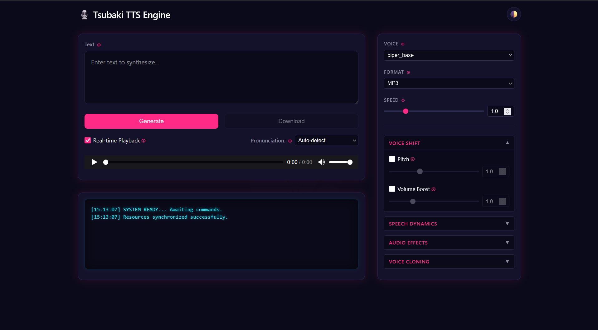

# Tsubaki TTS Engine v1.0.8

Production-grade local Text-to-Speech engine for AI agents, companions, VTubers, and OpenAI-compatible applications.

Piper is fast, lightweight, and easy to run, but its voices are tied to the model you choose. Tsubaki is a standalone engine built around **Piper (VITS) voice models** that keeps the efficiency of Piper while adding the missing layer: **voice freedom and audio control**.

Use standard Piper models locally, then add zero-shot voice cloning, interchangeable voices, pitch and volume control, DSP effects, spatial environments, streaming, and per-request audio control.

Built with **C# (.NET 10)** and **ONNX Runtime**, Tsubaki runs locally on Windows and Linux with CPU or GPU acceleration.

- Piper model engine — run standard Piper models locally
- Voice Freedom — use different voices without replacing the underlying Piper model
- Zero-shot voice cloning via OpenVoice V2
- OpenAI-compatible API — drop-in replacement for existing tools
- Dedicated Tsubaki API for detailed audio control
- Real-time streaming (Chunked Transfer Encoding)
- Studio-grade DSP effects and spatial environments
- No Python, no CUDA dependency hell
- Windows and Linux support

---

## Web Dashboard



Built-in web interface for testing voices and DSP effects, available immediately after launch.

Dashboard features:

- voice selection and testing
- DSP effects and spatial environments
- real-time streaming playback
- pitch and volume control
- voice cloning validation

---

# Download

**[Tsubaki TTS Engine v1.0.7 (GitHub Releases)](https://github.com/MrHryhorii/SmartStack/releases/tag/tsubakitts-v1.0.7)**

Direct Plug-and-Play binary downloads for Windows and Linux. Includes pre-configured base models and cloneable voices.

---

# Why Tsubaki Instead of Python TTS Stacks?

Most modern open-source TTS engines are written in Python. This often leads to "dependency hell": CUDA version conflicts, gigabytes of PyTorch libraries, and virtual environment nightmares.

Tsubaki is built with an engineering-first approach to distribution:

- **No Python Required:** Runs purely on compiled C# and `Microsoft.ML.OnnxRuntime`.
- **Portable (Self-Contained):** Can be compiled into a single executable. Just download and run.
- **Hardware Acceleration:** Runs on CPU by default, with optional WebGPU, DirectML, or CUDA acceleration for voice cloning.
- **Memory Protection (OOM Guard):** Built-in queueing and semaphore system that calculates available VRAM/RAM to prevent server crashes under heavy load.
- **True Concurrency (Shared Memory):** The common way Python TTS servers scale concurrency is by spinning up a separate worker process per request — each one duplicating the full model (often 2GB+) along with its own PyTorch/CUDA runtime in RAM, since getting true in-process parallelism right around the GIL is hard. On CPU and NVIDIA (CUDA) GPUs, Tsubaki loads the model exactly once and processes multiple API requests concurrently through a shared memory space, keeping RAM usage flat regardless of how many AI agents are talking at the same time. On DirectML — Windows' unified GPU backend covering NVIDIA, AMD, and Intel alike, since Tsubaki intentionally doesn't ship a separate Windows CUDA build — a small, fixed-size pool of sessions is used instead. This is a hardware limitation of DirectML itself, not a Tsubaki design choice; see `HardwareSettings` for details.

| Tsubaki                               | Typical Python TTS                   |
| ------------------------------------- | ------------------------------------ |
| Single executable                     | Python virtual environments          |
| OpenAI-compatible out of the box      | Custom APIs required                 |
| DirectML support (NVIDIA, AMD, Intel) | Often CUDA-only                      |
| Built-in DSP effects                  | External audio processing chains     |
| Real-time streaming                   | Full audio generated before playback |
| CPU-first deployment                  | GPU dependency pressure              |
| Portable self-contained builds        | Fragile installations                |
| True multithreading (Shared RAM)      | GIL bottleneck / Memory duplication  |

---

# Key Features

| Feature                    | Description                                                                                                                                                        |
| -------------------------- | ------------------------------------------------------------------------------------------------------------------------------------------------------------------ |
| OpenAI API Compatible      | Exposes a `/v1/audio/speech` endpoint compatible with the official OpenAI API. Drop-in replacement for SillyTavern, LangChain, AutoGen, and other AI agents. |
| Zero-Shot Voice Cloning    | Integrated with the OpenVoice V2 architecture. Clone any voice instantly by dropping a clean 10-second `.wav` file into the `Voices` folder.                       |
| Foreign Word Pronunciation | Offline language detection via Lingua. Detects foreign words and applies phoneme approximation for natural accented pronunciation.                                 |
| Studio-Grade DSP Effects   | Real-time audio effects (Telephone, Overdrive, Reverb, etc.), pitch and volume shifting.                                                                           |
| Real-Time Streaming        | Supports Chunked Transfer Encoding — listen to audio before generation is complete.                                                                                |
| Built-in Web Dashboard     | Sleek, user-friendly web interface available out-of-the-box for testing voices and effects.                                                                        |
| OOM Guard                  | Built-in queueing and semaphore system that prevents VRAM/RAM crashes under heavy load.                                                                            |
| No Python Required         | Pure C# and ONNX Runtime. Automatically detects GPU or falls back to CPU.                                                                                          |

---

# Who Is This For?

Tsubaki is designed for:

- AI companions and chatbots
- SillyTavern users
- AI VTubers
- local LLM stacks (Open WebUI, Ollama frontends)
- LangChain / AutoGen pipelines
- home AI servers
- any OpenAI-compatible application that needs local TTS

---

# Quick Start

## 1. Download the Release

Download the latest binary for your OS:

https://github.com/MrHryhorii/SmartStack/releases

---

## 2. Download a Piper Voice Model

All official Piper voices are hosted on HuggingFace:

https://huggingface.co/rhasspy/piper-voices/tree/main

For each voice you need to download exactly **2 files**:

- `.onnx` — the neural network weights (the large file)
- `.onnx.json` — metadata: sample rate, phonemes, speaker IDs

Place both files into the `Model/` folder next to the executable.

> Both files are required. The engine will fail to load without the accompanying `.json` config.

---

## 3. Run the Server

Start the executable. The browser dashboard opens automatically at:

```
http://localhost:5045
```

---

## 4. Test Speech Synthesis

```bash
curl http://localhost:5045/v1/audio/speech \
  -H "Content-Type: application/json" \
  -d '{
    "model": "tts-1",
    "input": "Hello from Tsubaki TTS.",
    "voice": "piper_base",
    "response_format": "mp3"
  }'
```

That is enough for a complete first launch.

---

# OpenAI API Compatibility

Tsubaki mimics the standard OpenAI `/v1/audio/speech` endpoint. Any tool or agent that knows how to talk to the OpenAI API can talk to Tsubaki immediately — just change the base URL.

Compatible with:

- SillyTavern
- Open WebUI
- LangChain
- AutoGen
- any custom OpenAI client

## Standard Request

```bash
curl http://localhost:5045/v1/audio/speech \
  -H "Content-Type: application/json" \
  -d '{
    "model": "tts-1",
    "input": "Text to synthesize.",
    "voice": "piper_base",
    "response_format": "mp3",
    "speed": 1.0
  }'
```

## Standard Parameters

| Field             | Type   | Description                                                                   |
| ----------------- | ------ | ------------------------------------------------------------------------------- |
| `model`           | string | Any value (e.g. `"tts-1"`) — ignored, present for compatibility               |
| `input`           | string | Text to synthesize                                                            |
| `voice`           | string | `piper_base` for the base Piper voice, or a cloned voice name (e.g. `"John"`) |
| `response_format` | string | `mp3`, `wav`, `opus`, `pcm`                                                   |
| `speed`           | float  | Speech speed multiplier. `1.0` is default.                                    |
| `stream`          | bool   | Enable chunked streaming. Not part of the official OpenAI schema, but widely accepted as a de facto standard by AI agents and frontends — see Real-Time Streaming below. |

This endpoint follows the official OpenAI request schema with `stream` additionally supported for Tsubaki streaming. For DSP effects, voice cloning tuning, and detailed audio control, use the dedicated Tsubaki Endpoint below.

---

# Real-Time Streaming

Tsubaki supports HTTP chunked streaming. Audio playback can begin before the full synthesis finishes — useful for AI companions, streaming agent pipelines, and real-time conversations.

Enable streaming per request:

```json
{
  "stream": true
}
```

Recommended server-side streaming configuration in `appsettings.json`:

```json
"StreamSettings": {
  "EnableStreaming": true,
  "FlushAfterEachSentence": true,
  "MinChunkSizeKb": 8
}
```

`FlushAfterEachSentence: true` means the client receives each synthesized sentence immediately as it is generated, rather than waiting for the full response. This is recommended for AI companion backends and real-time agent systems.

> WAV format does not support true chunked streaming because its header requires the total file size to be written upfront. For streaming, use `mp3` or `opus`.

---

# Tsubaki Endpoint

Alongside the OpenAI-compatible endpoint above, Tsubaki exposes its own dedicated endpoint at `/tsbk/audio/speech` — a separate, independent API, not an extension bolted onto the OpenAI one. It shares the same core fields (`model`, `input`, `voice`, `response_format`, `speed`, `stream`) and follows the same philosophy: only `input` is required, every other field is optional and falls back to a sensible engine or server-config default if omitted. That makes it just as easy to point a minimal client at as the OpenAI endpoint — you only gain access to more, never lose the simplicity.

The simplest way to think about the two APIs:

- `/v1/...` — use this when your client expects the OpenAI API. It provides the OpenAI-compatible request surface.
- `/tsbk/...` — use this when you want Tsubaki's full audio controls. It accepts the same basic request fields plus Tsubaki-specific parameters.

What it adds: real-time DSP effects, spatial environments, pitch/volume control, voice cloning tuning, and pronunciation variance — a much larger surface for **mechanically** controlling how something sounds, per request, without touching server config. This is especially useful for AI agents that want to express emotional state or acoustic context on the fly. Supported audio formats: `wav`, `mp3`, `opus`, `pcm`.

A detailed **Swagger UI** with every parameter is available at `http://localhost:5045/swagger` when the server is running.

## Full Request Example

```bash
curl http://localhost:5045/tsbk/audio/speech \
  -H "Content-Type: application/json" \
  -d '{
    "model": "tts-1",
    "input": "This message is coming from an old intercom.",
    "voice": "John",
    "response_format": "mp3",
    "speed": 1.0,
    "stream": true,

    "effect": "Telephone",
    "effect_intensity": 0.8,

    "environment": "ConcreteHall",
    "environment_intensity": 0.3,

    "pitch": 0.9,
    "volume": 1.5,

    "noise_scale": 0.667,
    "noise_w": 0.8,

    "clone_intensity": 0.85,
    "tone_temperature": 0.7
  }'
```

## DSP Effect Parameters

| Parameter               | Type   | Description                                                |
| ----------------------- | ------ | ---------------------------------------------------------- |
| `effect`                | string | DSP character effect to apply. See available values below. |
| `effect_intensity`      | float  | Effect intensity. `1.0` is full strength.                  |
| `environment`           | string | Acoustic spatial environment. See available values below.  |
| `environment_intensity` | float  | Reverb intensity. `0.25` is recommended.                   |

### Available Effects

| Value           | Description                                                                                  |
| --------------- | -------------------------------------------------------------------------------------------- |
| `None`          | Bypass — clean audio                                                                         |
| `Telephone`     | Lo-Fi equalization with hard transistor clipping                                             |
| `Overdrive`     | Warm tube saturation and cubic waveshaping distortion                                        |
| `Bitcrusher`    | Retro 8-bit / Arcade style sample rate decimation                                            |
| `RingModulator` | Classic Robot / Dalek metallic effect                                                        |
| `Flanger`       | Modulated short delay with heavy feedback                                                    |
| `Chorus`        | Thick, multi-voice ensemble effect                                                           |
| `LoFiTape`      | Simulates the warmth and coloration of an analog cassette tape                               |
| `DecoderGlitch` | Repeats short audio fragments to simulate a digital decoder glitch                           |
| `TacticalRadio` | CVSD codec simulation with heavy compression and slope-overload distortion                   |
| `FmRadio`       | Handheld FM radio effect with an amplitude limiter and signal-dependent noise floor          |
| `G711MuLaw`     | Classic North American digital telephony codec (μ-law) with 8-bit companding distortion      |
| `G711ALaw`      | European standard digital telephony codec (A-law) with characteristic quantization artifacts |

### Available Environments

| Value          | Description                                                                   |
| -------------- | ----------------------------------------------------------------------------- |
| `None`         | Dry signal only                                                               |
| `LivingRoom`   | Small room with short decay and balanced frequency response                   |
| `Stage`        | Performance stage with distinct pre-delay and slow shimmer                    |
| `ConcreteHall` | Large hall with long, dense reverb and strong early reflections               |
| `Dungeon`      | Tight stone space with short, dark, resonant flutter echoes                   |
| `Cave`         | Large enclosed space with deep resonance and very long, dark decay            |
| `Forest`       | Open outdoor space with discrete echoes rather than dense reverb tails        |
| `Muffled`      | Pure low-pass filter occlusion (simulates hearing through walls/earplugs)     |
| `Underwater`   | Muffled acoustics with high-frequency roll-off and slapback echo              |
| `InnerVoice`   | Micro-delay and dynamic low-pass to pull the voice inside the listener's head |

## Synthesis Parameters

| Parameter     | Type  | Description                                                             |
| ------------- | ----- | ----------------------------------------------------------------------- |
| `pitch`       | float | Pitch shift multiplier. `1.0` is original. `0.85` is noticeably deeper. |
| `volume`      | float | Output volume multiplier with soft-knee limiter. `1.0` is original.     |
| `noise_scale` | float | Controls pronunciation variance (intonation noise). Default: `0.667`.   |
| `noise_w`     | float | Phoneme duration variance (rhythm). Default: `0.8`.                     |

## Cloning Parameters

| Parameter          | Type  | Description                                                                                           |
| ------------------ | ----- | ----------------------------------------------------------------------------------------------------- |
| `clone_intensity`  | float | Latent space blend ratio between Piper base fingerprint and target voice. Per-request override of `ClonerSettings.CloneIntensity`. |
| `tone_temperature` | float | Variance during timbre transfer (tau). Per-request override of `ClonerSettings.ToneTemperature`.      |

See Fine-Tuning Cloning Behavior in the Voice Cloning section below for recommended ranges and what each one actually sounds like.

> **For AI agents:** These parameters can be passed dynamically per utterance — allowing an agent to mechanically express state. `"Telephone"` + `"ConcreteHall"` for a basement interrogation, `"LoFiTape"` for a flashback, higher `pitch` for tension, or tweaking `tone_temperature` to stabilize voice artifacts on the fly.

---

# Server-Side DSP Defaults

Since standard OpenAI clients (like SillyTavern) cannot send custom DSP effect parameters, Tsubaki allows you to set a **Default Effect** in `appsettings.json`. This effect will be automatically applied to all incoming API requests unless explicitly overridden by a custom client (like the built-in web dashboard).

## Default Effects & Environments

The following is an example configuration that enables LoFiTape and LivingRoom as server-wide defaults. The shipped defaults keep both the effect and environment disabled (`None`).

```json
"EffectsSettings": {
  "EnableGlobalEffects": true,
  "DefaultEffect": "LoFiTape",
  "DefaultIntensity": 1.0,
  "DefaultEnvironment": "LivingRoom",
  "DefaultEnvironmentIntensity": 0.25
}
```

Set `"DefaultEffect": "None"` to bypass effects entirely.

---

## Default Pitch & Volume

```json
"DspSettings": {
  "EnableLowPassFilter": true,
  "LowPassCutoffFrequency": 11000.0,
  "LowPassQFactor": 0.577,
  "DefaultPitch": 1.0,
  "DefaultVolume": 1.0
}
```

### LowPassQFactor

Controls the resonance and roll-off curve of the anti-aliasing filter. This is primarily used to clean up high-frequency artifacts (metallic "sand") generated during OpenVoice cloning.

- **`0.577` (Bessel curve):** Provides a smooth, analog-like roll-off without any resonant peaks. Highly recommended for voice cloning, as it naturally masks neural network artifacts and makes the voice sound warmer and less fatiguing.
- **`0.707` (Butterworth curve):** A classic digital filter curve. It remains perfectly flat until the cutoff point, making the voice sound brighter and preserving the crispness of consonants ("s", "t"). However, it may let more digital artifacts through and can sound slightly harsher on cloned voices.

### DefaultPitch

Sets the server-wide pitch shift applied to all generated audio.

| Value  | Effect                  |
| ------ | ----------------------- |
| `0.5`  | One octave lower        |
| `0.85` | Noticeably deeper voice |
| `1.0`  | Original (no change)    |
| `1.15` | Slightly higher voice   |
| `2.0`  | One octave higher       |

**Why use it?** Standard OpenAI-compatible clients (SillyTavern, AutoGen, LangChain) have no way to send a `pitch` parameter in their requests. If the base voice or a cloned voice feels too deep or too bright for your AI assistant's character, set this once and every request will automatically use the adjusted pitch — no client changes required.

**Per-request override:** If a client explicitly sends `"pitch": 0.85` in the request body, that value takes priority and the server default is ignored for that request only.

### DefaultVolume

Sets the server-wide volume multiplier applied to all generated audio. The engine uses a **soft-knee limiter** — the gain is applied linearly up to 80% of the signal ceiling, after which a smooth algebraic curve prevents harsh digital clipping on loud peaks.

| Value  | Gain (approx.) | Practical effect                               |
| ------ | -------------- | ---------------------------------------------- |
| `0.25` | −12 dB         | Very quiet — good for mixing under other audio |
| `0.5`  | −6 dB          | Noticeably quieter                             |
| `0.71` | −3 dB          | Slightly quieter                               |
| `1.0`  | 0 dB           | Original level (no change)                     |
| `1.41` | +3 dB          | Slightly louder                                |
| `2.0`  | +6 dB          | Noticeably louder — good for quiet clones      |
| `4.0`  | +12 dB         | Maximum boost — soft-knee limiter fully active |

**Why use it?** The perceived loudness of a cloned voice is determined almost entirely by the recording level of the reference `.wav` file. If your voice sample was recorded quietly, the cloned output will also be quiet. `DefaultVolume` lets you compensate for this once in `appsettings.json` rather than adjusting every client.

**Per-request override:** If a client explicitly sends `"volume": 2.0` in the request body, that value takes priority and the server default is ignored for that request only.

---

# Voice Cloning (OpenVoice V2)

## Adding a Voice

1. Place a clean voice sample (`.wav`, 5–15 seconds) into the `Voices/` folder.
2. The filename becomes the voice ID: `John.wav` → `"voice": "John"`.
3. Start or restart the server. On startup, Tsubaki extracts the voice fingerprint and creates a `.voice` file next to the sample.
4. The new voice is then automatically available by that name in API requests and appears in the Web Dashboard voice list.

Use it in any API request:

```json
{
  "voice": "John"
}
```

For the base Piper voice without cloning: `"voice": "piper_base"`.

## Recommended Sample Quality

- 5–15 seconds of clean speech
- minimal background noise
- no music, no reverb
- no clipping — if the sample peaks above 0 dBFS, the cloned output will also clip and distort
- **Recommended peak level: around −6 to −3 dBFS** — loud enough to fully capture the voice character, with just enough headroom to avoid distortion

## OpenVoice Cloning Models

The voice cloning engine requires separate OpenVoice ONNX models. Tsubaki downloads them **automatically from HuggingFace on the first run** — no manual setup needed.

If you prefer to download them manually:

**[Hinotsuba/OpenVoice-ONNX-v2 on HuggingFace](https://huggingface.co/Hinotsuba/OpenVoice-ONNX-v2)**

Place all three files into the `Cloner/` folder:

| File                | Description                                                                 |
| ------------------- | --------------------------------------------------------------------------- |
| `tone_extract.onnx` | Extracts a 256-dimensional voice fingerprint from a reference audio sample  |
| `tone_color.onnx`   | Transfers the extracted voice characteristics onto the generated base audio |
| `tone_config.json`  | Hyperparameters and structural configuration for both models                |

> These models are released under the **MIT License** and are free for commercial use.

> **Performance Note:** Zero-shot voice cloning is a mathematically intensive operation. While the base `piper_base` voice synthesizes almost instantly, applying a custom cloned voice takes significantly more processing time. If you are running the engine on a CPU and want faster voice cloning, consider significantly increasing `IntraOpNumThreads` in `appsettings.json` (e.g., to match your physical core count). The default value is kept intentionally moderate so the engine balances cloning throughput with other applications (like games, LLMs, or AI agents) running in the background.

## Fine-Tuning Cloning Behavior

Both settings below can be tuned server-wide via `ClonerSettings` in `appsettings.json`, or overridden per request via `clone_intensity`/`tone_temperature` on the Tsubaki Endpoint (see Cloning Parameters above) — a per-request value takes priority for that request only, otherwise the server default applies.

```json
"ClonerSettings": {
  "CloneIntensity": 1.0,
  "ToneTemperature": 0.7
}
```

**Tone Temperature** controls the variance in the latent space during voice color transfer. The shipped default is `0.7`, chosen as a stability-oriented setting.

- **High temperature (1.0 and above):** Makes the voice more emotional and lively, but significantly increases sensitivity to base model noise. On low-frequency models (16 kHz) or `medium` quality, this often causes micro-vibrations perceived as trembling or sobbing.
- **Low temperature (0.5 – 0.7):** Stabilizes the sound wave, making the voice feel "firmer" and more confident. This is the recommended range for eliminating the trembling effect on models with a limited frequency range.

**Clone Intensity** defines the blending coefficient (Latent Space Blending) between the base Piper fingerprint and the target voice.

- **Value 1.0:** Full timbre transfer, which can amplify digital artifacts.
- **Value 0.8 – 0.9 (Recommended):** Preserves some of the original Piper model's articulatory stability while overlaying the character of the chosen voice. This provides the best balance between voice similarity and audio cleanliness.

## Cloned Voice Volume

The perceived loudness of a cloned voice is **not** controlled by `ClonerSettings` — it is shaped by two factors: the **recording level of the reference sample** and the **natural pitch of the cloned voice**.

- **Recording level:** OpenVoice extracts a voice fingerprint from the magnitude spectrogram of your `.wav` file and transfers its energy envelope onto the generated audio. A quietly recorded sample produces a quietly cloned voice, regardless of the base Piper model's output level. If the sample is too loud or peaks above 0 dBFS (clipping), the cloned audio will also clip and distort.

- **Voice pitch:** Lower-pitched voices — deep male voices, bass characters — naturally concentrate their spectral energy in the low-frequency range, which results in a lower overall magnitude in the spectrogram. Because OpenVoice transfers this energy profile directly, deep voices will consistently sound quieter than brighter, higher-pitched ones, even from identically recorded samples. This is an inherent property of the cloning architecture, not a bug.

**Recommended recording level:** aim for peaks around **−6 to −3 dBFS** — loud enough to fully capture the voice character, with just enough headroom to avoid distortion.

If the cloned voice is too quiet, compensate using `DefaultVolume` in `DspSettings`, or send `"volume"` per request:

```json
{
  "voice": "John",
  "volume": 2.0
}
```

This applies a clean gain stage with soft-knee limiting **before** the audio is encoded, so the result stays clean without harsh digital clipping.

---

# Piper Voice Models

## Finding Voice Models

All official Piper voices are hosted on HuggingFace:

**[rhasspy/piper-voices on HuggingFace](https://huggingface.co/rhasspy/piper-voices/tree/main)**

The repository contains **35 languages**, each in its own folder (`en`, `de`, `fr`, `uk`, `zh`, etc.).

## What to Download

For each voice you need to download exactly **2 files**:

| File          | Extension    | Description                                  |
| ------------- | ------------ | -------------------------------------------- |
| Model weights | `.onnx`      | The neural network — this is the large file  |
| Model config  | `.onnx.json` | Metadata: sample rate, phonemes, speaker IDs |

### How to Download a Voice

1. Browse to your language folder, e.g. [`/en`](https://huggingface.co/rhasspy/piper-voices/tree/main/en)
2. Navigate into a voice subfolder (e.g. `en_US/lessac/medium/`)
3. Download both files: `en_US-lessac-medium.onnx` and `en_US-lessac-medium.onnx.json`
4. Place both files into the `Model/` folder next to the executable

> Both files **must be present** — the engine will fail to load without the accompanying `.json` config.

## Available Quality Tiers

Most voices come in multiple quality levels. Higher quality = larger file and more VRAM:

| Quality  | Approx. Size | Notes                            |
| -------- | ------------ | -------------------------------- |
| `x_low`  | ~5 MB        | Fast, lower fidelity             |
| `low`    | ~15 MB       | Good for low-end hardware        |
| `medium` | ~60 MB       | Recommended for most use cases   |
| `high`   | ~130 MB      | Best quality, requires more VRAM |

> **For voice cloning, the `high` quality tier (22050 Hz) is strongly recommended.** Its fuller frequency spectrum allows the OpenVoice neural network to operate without producing instability artifacts such as trembling or "crying" effects that are common on `medium` (16 kHz) models.

---

# Installation & Model Management

## Adding a Piper Model

The server features a highly flexible model discovery system. There are **3 ways** to specify the path to your `.onnx` and `.json` files:

### Option A — Out of the Box (Recommended)

Place your model files into the `Model/` folder exactly next to the compiled executable. The server will automatically find them on startup.

### Option B — Change Directory

If you store models on a different drive, open `appsettings.json` and change the `ModelDirectory`:

```json
"ModelSettings": {
  "ModelDirectory": "D:\\AI_Models\\Piper"
}
```

### Option C — Exact File Paths (Advanced)

If your files have custom names or are scattered across the system, you can specify exact paths:

```json
"ModelSettings": {
  "ExactModelFilePath": "C:\\Models\\voice.onnx",
  "ExactConfigFilePath": "D:\\Configs\\voice_config.json"
}
```

> **Windows users:** When writing absolute paths in JSON, you must use double backslashes (`\\`).

---

# Building From Source

Requires the [.NET 10 SDK](https://dotnet.microsoft.com/download).

## Clone Only the ONNX_Runner Folder (Recommended)

```bash
git clone --filter=blob:none --sparse https://github.com/MrHryhorii/SmartStack.git
cd SmartStack
git sparse-checkout set ONNX_Runner
cd ONNX_Runner
```

Alternatively, clone the full SmartStack monorepo:

```bash
git clone https://github.com/MrHryhorii/SmartStack.git
cd SmartStack/ONNX_Runner
```

## Compiling the Server

Tsubaki provides several build variants for different hardware configurations. You can build a **Lightweight CPU-only** version for standard TTS, or enable **WebGPU, DirectML, or CUDA** for GPU-accelerated voice cloning.

> **Which version should I choose?**
> For standard TTS generation, the **CPU-only version** is highly recommended. Piper models are designed to be fast and efficient on modern CPUs, making this the simplest option for most users.
>
> If you plan to use **Voice Cloning (OpenVoice V2)**, GPU acceleration is strongly recommended. WebGPU is the preferred choice for personal and local use because it provides broad GPU compatibility without requiring a vendor-specific runtime. DirectML is available as an alternative on Windows, while CUDA is available for NVIDIA GPUs on Linux.
>
> **WebGPU and concurrency:** The current WebGPU implementation is optimized for local and personal use. Piper base synthesis remains on the CPU, while OpenVoice voice conversion can use the GPU. GPU cloning requests are currently processed one at a time for stability. This is usually not a limitation for a personal TTS setup, where requests are generated sequentially. If WebGPU is unavailable, the cloning stage automatically falls back to the CPU. Parallel GPU execution is planned for a future release.

### 1. Windows (WebGPU + CPU) — Recommended for Voice Cloning

Uses WebGPU for hardware-accelerated OpenVoice voice cloning.

```bash
dotnet publish -c Release -r win-x64 -p:UseWebGpu=true --self-contained true -o ./Publish/Tsubaki-Windows-WebGPU
```

### 2. Windows (DirectML + CPU)

Alternative Windows GPU acceleration with support for NVIDIA, AMD, and Intel GPUs.

```bash
dotnet publish -c Release -r win-x64 --self-contained true -o ./Publish/Tsubaki-Windows-DML
```

### 3. Windows (Lightweight: CPU Only) — Recommended for Base TTS

```bash
dotnet publish -c Release -r win-x64 -p:CpuOnly=true --self-contained true -o ./Publish/Tsubaki-Windows-CPU
```

### 4. Linux (WebGPU + CPU) — Recommended for Voice Cloning

Uses WebGPU for hardware-accelerated OpenVoice voice cloning.

```bash
dotnet publish -c Release -r linux-x64 -p:UseWebGpu=true --self-contained true -o ./Publish/Tsubaki-Linux-WebGPU
```

### 5. Linux (Lightweight: CPU Only) — Recommended for Base TTS

```bash
dotnet publish -c Release -r linux-x64 -p:CpuOnly=true --self-contained true -o ./Publish/Tsubaki-Linux-CPU
```

### 6. Linux (CUDA + CPU) — Advanced Users Only

Builds the NVIDIA CUDA version. See the Linux Deployment section for strict hardware and software requirements:

```bash
dotnet publish -c Release -r linux-x64 --self-contained true -o ./Publish/Tsubaki-Linux-CUDA
```

### 7. Docker (Lightweight CPU)

The provided `Dockerfile` is pre-configured to build the lightweight CPU version to keep your container small and stable:

```bash
docker-compose up --build -d
```

> **Voice model required:** The compiled application does not include a Piper voice model to keep the binary size small. Before starting the server, download a voice model (`.onnx` + `.onnx.json`) and configure its path. See the Installation & Model Management section above.

---

# Docker & Linux Deployment

## Docker (Recommended for Servers)

The provided `docker-compose.yml` and `Dockerfile` are highly optimized and pre-configured to build the **Lightweight CPU** version. All native dependencies are handled automatically:

```bash
docker-compose up --build -d
```

## Bare-Metal Linux (CPU)

If you are running directly on a Linux host without Docker, you must install the native TTS engine and MP3 encoder libraries before running the server:

```bash
sudo apt-get update && sudo apt-get install -y espeak-ng libmp3lame0
```

The server also includes a **Linux auto-healing system**: on startup it automatically detects and fixes common native library symlink issues for `libespeak-ng.so` and `libmp3lame`, which are particularly common in containerized environments.

## Bare-Metal Linux (CUDA GPU) — Not Recommended

Tsubaki supports NVIDIA GPU acceleration on Linux, but we **strongly advise against using it** unless absolutely necessary.

For TTS tasks, the performance gain over a modern CPU is often negligible, while the downsides are significant:

- **Massive Build Size:** The CUDA build is over 1.5 GB larger.
- **High Power Consumption:** Keeps the GPU active and draws significantly more power.
- **Dependency Hell:** You must manually install and strictly match exact versions of proprietary NVIDIA libraries.

If you still want to proceed, your host system must have the following installed and correctly added to `$PATH`:

- Proprietary NVIDIA Linux Drivers
- NVIDIA CUDA Toolkit (v12.x compatible)
- NVIDIA cuDNN (v9.x)

> If any of these are missing or mismatched, the ONNX runtime will crash with `libcudnn.so.9: cannot open shared object file` and gracefully fall back to CPU execution anyway.

---

# Server Configuration (appsettings.json)

The `appsettings.json` file is completely pre-configured and ready to use out-of-the-box. Most users only ever need to set the model path and the languages list — everything else can safely be left at its defaults.

---

## Phonemizer & Language Settings

The `PhonemizerSettings` block controls how the server handles text outside your base model's own language, using offline language detection via Lingua (see Credits below). `SupportedLanguages` is the list of languages the engine will actively try to recognize and adapt the model's own phonemes toward — the result is an accented approximation, not native pronunciation, if the target language is phonetically far from your base model. Leaving it empty doesn't turn detection off — the base model's language is always added to the candidate pool regardless, so an empty list just leaves the detector with nothing else to compare against, and it never switches. It still loads and runs on every chunk; to actually disable language detection and its memory/CPU cost, set `UseLanguageDetector: false` instead.

```json
"PhonemizerSettings": {
  "SupportedLanguages": ["en", "uk", "fr"],
  "UseLanguageDetector": true,
  "MaxBonusMultiplier": 0.60,
  "BonusMinLetterCount": 8,
  "BonusMaxLetterCount": 32,
  "MixedLanguageOverrideThreshold": 0.85,
  "MinSentenceLengthForOverride": 20
}
```

A different *script* (Cyrillic hitting an English model, for example) is a hard, unambiguous boundary — detected with certainty and mapped to the closest phoneme approximation. Words in the *same* script as your model (French vs. English vs. Spanish, all Latin) are the hard case: the engine has to statistically guess, evaluating **chunks** — one script run between two punctuation marks — rather than single words, since more context gives a far more reliable answer. A foreign word with no punctuation around it gets evaluated together with its neighbors, which can pull the result either way.

| Parameters | What they do |
| ----------- | -------------- |
| `MaxBonusMultiplier`, `BonusMinLetterCount`, `BonusMaxLetterCount` | Boosts the model's own language for short, statistically ambiguous chunks — full bonus at or below `BonusMinLetterCount` letters, none at or above `BonusMaxLetterCount`, interpolated between. *Example: "Hi" (2 letters) got the full ×1.6 bonus and read English; "I am Alejandro" (12 letters) got a smaller ×1.5 bonus — not enough to beat a strongly Spanish-leaning raw score, so it read with Spanish pronunciation (arguably correct for a Spanish name).* |
| `MixedLanguageOverrideThreshold`, `MinSentenceLengthForOverride` | The bonus above has a hard ceiling it sometimes can't overcome. This override instead checks the model language's confidence across the **whole sentence** once, and applies it to any chunk under `BonusMaxLetterCount` letters — but only if the sentence has at least `MinSentenceLengthForOverride` letters, and its confidence clears `MixedLanguageOverrideThreshold`. *Example: "Yes, I am Hermes, an AI model created by Anthropic." — "Hermes" alone reads as French (`ɛʁmˈɛs`); with the override, the confidently-English sentence around it corrects this to `hˈɜːmiːz`.* |

> **Trade-off:** the override can't tell an accidental misread apart from a deliberate foreign phrase, and punctuation isolation doesn't exempt a chunk from it — *"...and whispered: c'est la vie."* still read in English despite being comma/colon-separated, because the surrounding sentence measured `0.9666` confidence in English, comfortably above the default `0.85` threshold. Raising `MixedLanguageOverrideThreshold` above that (or writing a shorter sentence that falls under `MinSentenceLengthForOverride`) would have left "c'est la vie" to the bonus table above instead — which, being a 9-letter phrase with no strong pull toward English, would most likely have read in French. For language-learning content or quoted foreign phrases, raise the threshold toward `1.0`, or above `1.0` to disable the override entirely (confidence never exceeds `1.0`).

None of this is unique to Tsubaki — identifying a language from a handful of characters is a hard problem for any detector, including the much heavier neural models commercial systems use. The parameters above bias that inherent uncertainty toward whichever outcome fits your case, they don't remove it: keep `SupportedLanguages` narrow (fewer rival candidates means fewer ways for an ambiguous word to lose), and raise the bonus/override values for a stable, unbroken accent, or lower them if foreign words should switch pronunciation more readily.

- **Format:** Short espeak codes — `"en"`, `"uk"`, `"de"`, `"fr"`, `"zh"`, etc.
- **Performance Warning:** Each added language increases memory consumption and slows down detection. Keep this to **2–3 languages** most likely to appear in your texts.

---

## Network & Access

- **`Kestrel > Endpoints > Http > Url`** — Defines the port the server listens on. Default is `http://+:5045`.

- **`CorsSettings`** — Controls Cross-Origin Resource Sharing. Setting `"AllowAnyOrigin": true` completely disables access limits and is perfectly fine for local or home use. If set to `false`, the server will only accept requests from the domains listed in `"AllowedOrigins"`, which you can freely edit to secure your endpoints.

- **`ApiSettings > MaxTextLength`** — Imposes a hard character limit on text-to-speech requests. Setting this to `0` removes the limit entirely, which is perfectly fine for personal or home use.

---

## Text Processing

- **`ChunkerSettings`** — Piper models notoriously struggle with massive, unbroken blocks of text. This setting automatically slices "walls of text" and run-on sentences into smaller, logical chunks for stable and high-quality generation. Keep this enabled.

```json
"ChunkerSettings": {
  "MaxChunkLength": 250,
  "SentencePauseSeconds": 0.3
}
```

---

## Resource Management

- **`HardwareSettings`** — Tells the server's internal queueing system how many generation requests are allowed to run at the same time, and handles hardware routing. **For home use, you can completely ignore this section and leave the defaults.**[cite: 8]

```json
"HardwareSettings": {
  "MaxConcurrentGpuRequests": 3,
  "MaxConcurrentCpuRequests": 2,
  "PiperGpuDeviceId": 0,
  "OpenVoiceGpuDeviceId": 0,
  "ForcePiperToCpu": true
}
```

| Parameter                 | Description                                                                                                                                                                                                                                                                                                                                                                                                            |
| -------------------------- | ------------------------------------------------------------------------------------------------------------------------------------------------------------------------------------------------------------------------------------------------------------------------------------------------------------------------------------------------------------------------------------------------------------------- |
| `MaxConcurrentGpuRequests` | Maximum number of requests processed on the GPU simultaneously. **On CUDA (NVIDIA, Linux only), this is a pure throttle** — a queueing limit with no extra memory cost, since all concurrent requests share a single loaded model. **On DirectML (Windows — NVIDIA, AMD, and Intel all route through this backend), this number is not just a throttle — it is the exact size of the session pool kept resident in VRAM**, because DirectML cannot run one session from multiple threads concurrently. Raising this value on DirectML increases VRAM usage predictably and linearly: model size × `MaxConcurrentGpuRequests`, and separately again for the OpenVoice Tone Color Converter if voice cloning is enabled.[cite: 8] |
| `MaxConcurrentCpuRequests` | Maximum number of concurrent CPU-based generation tasks. `0` or a negative value auto-detects and uses all available physical cores.                                                                                                                                                                                                                                                                                |
| `PiperGpuDeviceId`         | Hardware index (starting at `0`) of the GPU used to execute the base Piper neural network. |
| `OpenVoiceGpuDeviceId`     | Hardware index of the GPU used to execute the OpenVoice Tone Color Converter. Can be assigned a different ID in multi-GPU setups to split the computational load. |
| `ForcePiperToCpu`          | Forces the base Piper model to execute on the CPU regardless of GPU presence. When `true` (Hybrid Routing), the CPU handles parallel Piper text-to-speech generation while the GPU is reserved exclusively for the computationally heavy OpenVoice cloning passes, preventing bottlenecks and maximizing concurrent throughput. |

> **DirectML users:** think of this setting as a direct trade — each unit of `MaxConcurrentGpuRequests` buys one more simultaneous request, at the cost of one more full copy of the relevant model(s) sitting in VRAM. CUDA and CPU users don't pay this cost, since they share one session across all concurrent requests.

- **`RateLimitSettings`** — Provides basic anti-spam and anti-DDoS protection by restricting the number of requests allowed from a single IP address within a specific time window. Useful for public-facing deployments.

```json
"RateLimitSettings": {
  "PermitLimit": 20,
  "WindowSeconds": 10,
  "QueueLimit": 5
}
```

---

## Audio & DSP

- **`EffectsSettings`** — Standard OpenAI API clients (like SillyTavern or AutoGen) do not support sending custom DSP parameters in their requests. This section allows you to define a `"DefaultEffect"` that the server will automatically apply to all incoming API requests unless explicitly overridden by a custom client (like the built-in web dashboard).

- **`DspSettings`** — Adds an audio cleanup pass (Low-Pass Filter) to remove high-frequency noise, and allows setting **server-wide default pitch and volume** applied to every request. This is especially useful when Tsubaki is used as a personal AI assistant backend — you can tune the voice character once in the config and every client, including standard OpenAI-compatible ones that cannot send custom parameters, will automatically receive the adjusted audio.

- **`ClonerSettings`** — Controls the OpenVoice cloning behavior. It is best not to touch these. Increasing the intensity often yields a caricature-like exaggeration of the voice characteristics, while decreasing it simply reverts the audio back to the default base model's voice.
- **`EnableCloning`** — Enables or disables OpenVoice voice cloning. Leave it `true` to use voices stored in the `Voices/` folder; when enabled, those voices are discovered automatically at server startup and appear in the Web Dashboard voice list.

---

# ONNX Runtime Optimization

This section provides low-level control over the internal MLAS (Microsoft Linear Algebra Subprograms) math engine, heavily optimizing execution. Since the CPU and GPU execution paths have fundamentally different concurrency needs, `Cpu` and `Gpu` use independent threading and memory profiles rather than a single shared configuration. The defaults are already configured as a balanced "golden standard" for home use. **If you are not tuning performance, leave this entire section unchanged.** Change these only if you understand the consequences.

```json
"OnnxSettings": {
  "EnableGraphOptimization": true,
  "Cpu": {
    "ExecutionMode": "Sequential",
    "IntraOpNumThreads": 4,
    "InterOpNumThreads": 1,
    "EnableMemoryPattern": true,
    "EnableCpuMemArena": true
  },
  "Gpu": {
    "ExecutionMode": "Sequential",
    "IntraOpNumThreads": 1,
    "InterOpNumThreads": 1,
    "EnableMemoryPattern": true,
    "EnableCpuMemArena": false
  }
}
```

| Parameter             | Description                                                                                                                                                                                                                                                                                                                        |
| --------------------- | ----------------------------------------------------------------------------------------------------------------------------------------------------------------------------------------------------------------------------------------------------------------------------------------------------------------------------------- |
| `IntraOpNumThreads`   | Threads used for matrix math within a single neural network node. `0` enables smart auto-detection of all available physical cores. The `Cpu` profile defaults to a fixed, moderate value (`4`) to balance per-request throughput with concurrent requests; the `Gpu` profile defaults to `1`, since the heavy lifting already happens on the GPU itself. |
| `InterOpNumThreads`   | Parallelization across different graph nodes. For TTS (which is strictly sequential), this must **always be `1`**. Higher values cause thread thrashing and micro-stutters.                                                                                                                                                       |
| `EnableMemoryPattern` | Pre-allocates memory blocks during model load rather than dynamically during inference. Decreases latency per request by 5–10%.                                                                                                                                                                                                    |
| `EnableCpuMemArena`   | Utilizes an isolated memory arena for ONNX tensors. **Critical for .NET:** Bypasses the C# Garbage Collector entirely during audio generation, eliminating GC-induced freezes on long texts. Disabled by default in the `Gpu` profile, since this optimization targets CPU-resident memory and doesn't apply to tensors that live in VRAM. |
| `ExecutionMode`       | `"Sequential"` is the safest and fastest mode for Piper and OpenVoice architectures, as they do not benefit from parallel graph execution.                                                                                                                                                                                         |

## Concurrency & CPU Bottlenecks

The TTS engine and API are fully thread-safe and natively support concurrent HTTP requests. Two independent settings control how the CPU handles load, and they pull in opposite directions if left uncoordinated:

- `OnnxSettings.Cpu.IntraOpNumThreads` controls how many cores **a single request** can use. `0` lets one request spread across every physical core — fastest for that one request, but leaves nothing for anyone else. A fixed value like `4` caps each request to a controlled portion of the CPU on purpose, so it doesn't crowd out other concurrent requests.
- `HardwareSettings.MaxConcurrentCpuRequests` controls how many requests are allowed to run **in parallel** at all. `0` (or a negative value) auto-detects and allows up to one request per physical core; a fixed value caps it directly.

If both are left at `0` under real concurrent load, every incoming request tries to claim every core at once — severe CPU context-switching, and generation speed scales down linearly per simultaneous user. The shipped defaults (`IntraOpNumThreads: 4`, `MaxConcurrentCpuRequests: 2`) are a middle-ground compromise for home use, tuned to give each active request a reasonable amount of CPU while preventing too many requests from competing for the same cores.

**Handling High-Load Environments:**

- **Option A (Lowest Latency, single user):** Set `IntraOpNumThreads: 0` so each request can use every core, and keep `MaxConcurrentCpuRequests: 1` so requests queue one at a time via `RateLimitSettings` or a message queue (e.g., RabbitMQ, Redis) instead of competing for cores.
- **Option B (Maximum Concurrency, many simultaneous users):** Lower `IntraOpNumThreads` to `1` or `2` so each request claims only a slice of the CPU, and raise `MaxConcurrentCpuRequests` — or set it to `0` to auto-match your physical core count — so many smaller-footprint requests can run side by side without thread thrashing.

Both settings only affect the CPU execution path — GPU threading and concurrency are controlled independently via `OnnxSettings.Gpu` and `HardwareSettings.MaxConcurrentGpuRequests`.

---

# API Endpoints

**OpenAI-compatible:**

| Method | Endpoint          | Description                     |
| ------ | ----------------- | -------------------------------- |
| `POST` | `/v1/audio/speech` | Main TTS endpoint                |
| `GET`  | `/v1/models`       | OpenAI-compatible model listing  |
| `GET`  | `/v1/models/{id}`  | OpenAI-compatible model by ID    |
| `GET`  | `/v1/health`       | Server health check              |

**Tsubaki Endpoint:**

| Method | Endpoint                   | Description                          |
| ------ | -------------------------- | ------------------------------------- |
| `POST` | `/tsbk/audio/speech`       | Main TTS endpoint, full parameter set |
| `POST` | `/tsbk/audio/phonemize`    | Text phonemization (for diagnostics)  |
| `GET`  | `/tsbk/audio/voices`       | List available voices                 |
| `GET`  | `/tsbk/audio/effects`      | List available DSP effects            |
| `GET`  | `/tsbk/audio/environments` | List available acoustic environments  |

**Universal:**

| Method | Endpoint  | Description         |
| ------ | --------- | -------------------- |
| `GET`  | `/health` | Server health check  |

## Swagger UI

A detailed Swagger UI with every parameter (Pitch, Volume, NoiseScale, CloneIntensity, etc.) is available at:

```
http://localhost:5045/swagger
```

---

# Open Source Credits & Acknowledgements

Tsubaki TTS Engine stands on the shoulders of giants. A massive thank you to the authors of the original models and open-source libraries that made this possible.

## AI Models & Datasets

- [**Piper TTS**](https://github.com/rhasspy/piper) — The core VITS neural network architecture by Rhasspy.
- [**OpenVoice V2**](https://github.com/myshell-ai/OpenVoice) — The innovative tone color cloning architecture by MyShell.
- [**PHOIBLE**](https://phoible.org/) — Cross-linguistic phonological data used for fallback phoneme matching.

## C# / .NET Libraries

- [**Microsoft.ML.OnnxRuntime**](https://github.com/microsoft/onnxruntime) — GPU-accelerated neural network inference.
- [**NAudio & NAudio.Lame**](https://github.com/naudio/NAudio) — Audio processing and MP3 encoding.
- [**SoundTouch.Net**](https://github.com/owoudenberg/soundtouch.net) — High-quality pitch and tempo shifting (WSOLA algorithm).
- [**SearchPioneer.Lingua**](https://github.com/searchpioneer/lingua-dotnet) — Fast, offline language detection for foreign word pronunciation.

## Voice Sources & Attribution

The example voice fingerprints bundled with Tsubaki are derived from the
**LibriTTS-R** corpus:

> Yuma Koizumi, Heiga Zen, Shigeki Karita, Yifan Ding, Kohei Yatabe,
> Nobuyuki Morioka, Michiel Bacchiani, Yu Zhang, Wei Han, Ankur Bapna.
> *"LibriTTS-R: A Restored Multi-Speaker Text-to-Speech Corpus"*, Interspeech 2023.
> Source: http://www.openslr.org/141/
> License: [CC BY 4.0](https://creativecommons.org/licenses/by/4.0/)

No audio, model output, or vocal characteristics from any commercial TTS
provider (OpenAI or otherwise) were used to create these fingerprints.

### A note on voice naming

Some bundled voice names (e.g. `alloy`, `echo`, `nova`) intentionally match
names used by OpenAI's text-to-speech API. This is purely a **compatibility
convenience** for clients that only accept a fixed voice list and don't
allow a custom voice name to be entered — not a claim that these are
OpenAI's voices, or that Tsubaki is affiliated with, endorsed by, or
sponsored by OpenAI. The actual vocal characteristics behind each of these
names come entirely from LibriTTS-R speakers (see Attribution above) and
will sound different from OpenAI's official voices.

---

# License & Usage

This project is open-source.

We strongly believe in the open-source community. If you use this engine (ONNX Runner / Tsubaki) in your products, create a fork, or integrate it into a commercial or open-source project, please **provide a link back to this original repository** in your documentation or credits section. Your attribution helps this project grow.